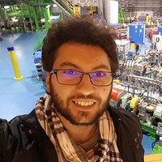

# About Me
## Introduction

As you can tell by the not-so-hidden hints around the website, my name is Marco Dagrada, I'm 27 years old and I currently live in Pavia, Italy.

I **LOVE** learning, especially about technology, psychology and oriental philosophy. You can probably catch me on a plane or on a train reading books about those things or testing out new stuff.

One of my favourite topics is Cryptocurrencies, I mined some Bitcoin during early 2010, while I was a student, using basic hardware when Bitcoin was still at the beginning of its road to the fame. Now I often spend time trading cryptos and playing around, keeping myself informed about the latest ICOs.

In my spare time, I enjoy a good workout session and I volunteer in the Italian Red Cross, Pavia Committee. Those two things contribute to make me feeling good as a human being, allowing me to improve myself on things hard to work on in my job as a Consultant/Full-Stack Developer.

Another of my passions is teaching. I think teaching puts you in the spot of being forced to know what you're actually talking about, allowing you to deeply understand topics and confront with people about them, learning much more and leading to become an expert.

I currently work (also) as a trainer, teaching new hires what they need to know to get the most out of their job in  Telnext/Deloitte Digital. During last summer I also spent a week as a teacher for the DIGITA Academy project at the University "Federico II" in Napoli.

I'm (well, I was) an [hardcore videogame player](https://www.dotabuff.com/players/29917430). Specifically, I love [DotA2](https://en.wikipedia.org/wiki/Dota_2). It's such a beautiful game: despite its not-state-of-the-art graphics, it combines decision making, team building, team working, planning, mechanical skill development and it's packed with emotions. It's literally the same game scenario over and over again but it **NEVER** gets boring.

## Education
Since 1998, when my parents gifted me with my frist personal computer, I have been interested in technology and software, which led me through making decisions about my education for my entire life.
I got a Computer Expert ("Perito Informatico" in italian) diploma from the "G. Cardano" Technical Institute (High School).
I graduated in 2015, getting my Master's Degree in Computer Engineering at the University Of Pavia, specializing in the Computer Science and Multimedia branch, with a thesis entitled "Development of an Android Library for Video Games through TDD".
After that, I got a job as Salesforce Technical Expert and developer @Telnext combined with a 1st level Post-Graduate Degree (Professional Master's Programme) in Cloud Computing and Agile Methodologies in collaboration with Politecnico di Milano and Cefriel.

I love keeping myself up-to-date on the latest tech topics through tech websites and by partecipating to conferences.