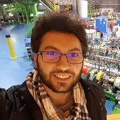

# About Me
## Introduzione

Come potete dedurre dalle (non troppo nascoste) tracce che ho lasciato in giro per il sito, mi chiamo Marco Dagrada, ho 27 e attualmente vivo a Pavia, in Italia.

Ho una fame insaziabile di conoscenza, in particolare riguardo nuove tecnologie, psicologia e filosofia orientale. Con molta probabilità mi potrete incontrare su un treno o su un aereo mentre leggo qualche libro a proposito di tali argomenti o mentre testo cose nuove al computer.

Uno tra i miei argomenti preferiti sono le Criptovalute, ho fatto del mining di Bitcoin nei primi mesi del 2010, mentre studiavo ancora all'università, usando hardware poco costoso, quando Bitcoin era ancora all'inizio della sua scalata verso la celebrità. Ora faccio spesso trading online e mi guardo un po' in giro, tenendomi aggiornato sulle ultime ICO.

Nel mio tempo libero mi piace evitare di afflosciarmi andando in palestra, oppure fare volontariato per la Croce Rossa Italiana, nel comitato di Pavia. Queste due cose mi fanno sentire bene, permettendomi di migliorare su cose che è difficile imparare nel mio lavoro come Consulente/Full-Stack Developer, anche se sicuramente qualche applicazione pratica la riesco sempre a trovare.

Un'altra delle mie passioni è l'insegnamento. Penso che insegnare ti metta in qualche modo alle strette, costringendoti ad andare a fondo sugli argomenti di cui tratti e permettendoti di avere un confronto diretto con le altre persone a riguardo, imparando di più e portandoti a diventare un esperto dell'argomento.

Attualmente lavoro (tra le altre cose) anche come trainer, insegnando ai neo-assunti quel che serve loro per avere sin da subito un impatto importante nel proprio lavoro in Telnext/Deloitte Digital. Nell'ultima estate ho anche trascorso una settimana come insegnante per la DIGITA Academy, progetto svolto presso l'università Federico II di Napoli.

Sono (o meglio ero) un [videogiocatore accanito](https://it.dotabuff.com/players/29917430), in particolare di [DotA2](https://en.wikipedia.org/wiki/Dota_2). E' un gioco fantastico: nonostante la grafica non particolarmente avanzata, combina decision making, team building, team working, planning, mechanical skill development ed è sempre emozionante e ricco di colpi di scena. Si gioca letteralmente lo stesso scenario di gioco ogni partita ma non diventa **MAI** noioso.

## Formazione
Sin dal 1998, quando i miei genitori mi regalarono il primo computer, sono appassionato di tecnologia e di software, passione che ha guidato tutte le scelte relative alla mia educazione nella vita.
Mi sono diplomato come perito informatico all'istituto G.Cardano di Pavia.
Nel 2015 ho conseguito una laurea magistrale in Computer Engineering (in lingua inglese) presso l'Università degli studi di Pavia, specializzandomi nel ramo Computer Science and Multimedia, con una tesi intitolata "Development of an Android Library for Video Games through TDD", che mi ha permesso di comprendere meglio tutto ciò che sta dietro una delle passioni che mi ha accompagnato per tutta la vita, i videogiochi.
Dopo la laurea, ho iniziato a lavorare come Salesforce Technical Expert e Developer in Telnext SRL, cominciando contemporaneamente un master di primo livello in Cloud Computing & Agile Methodologies presso il Politecnico di Milano in collaborazione con Cefriel.